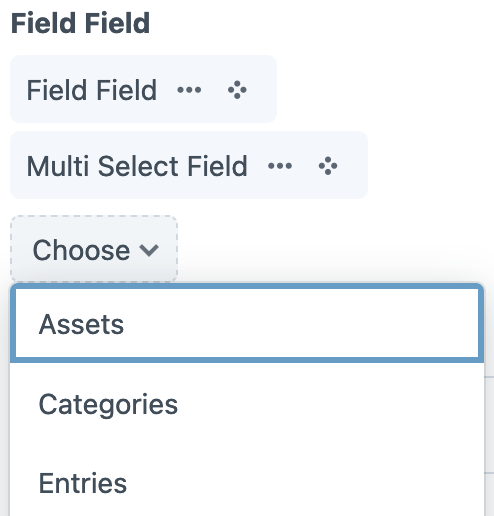
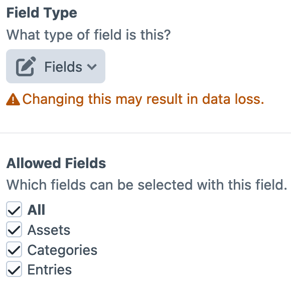

# Usage

When editing a Craft element, the input for a Field Field resembles a Multi Select field.



When editing a Field Field's settings, the allowed field groups can be chosen.



## Template examples

Accessing a Craft element's field value for a Field Field returns a [`FieldCollection`](https://github.com/spicywebau/craft-field-field/blob/1.x/src/collections/FieldCollection.php) of the selected fields. The main idea behind Field Field was to make it easy to refer to different fields in different entries within the same entry type; how exactly you'd work with the Field Field value to achieve this depends on whether you've selected one or many fields, but generally involves calling the Craft element's `getFieldValue()` method with the handle(s) of the selected field(s).

### One field selected

```twig


{# ... #}
```

### Multiple fields selected

```twig

    
    {# ... #}

```
